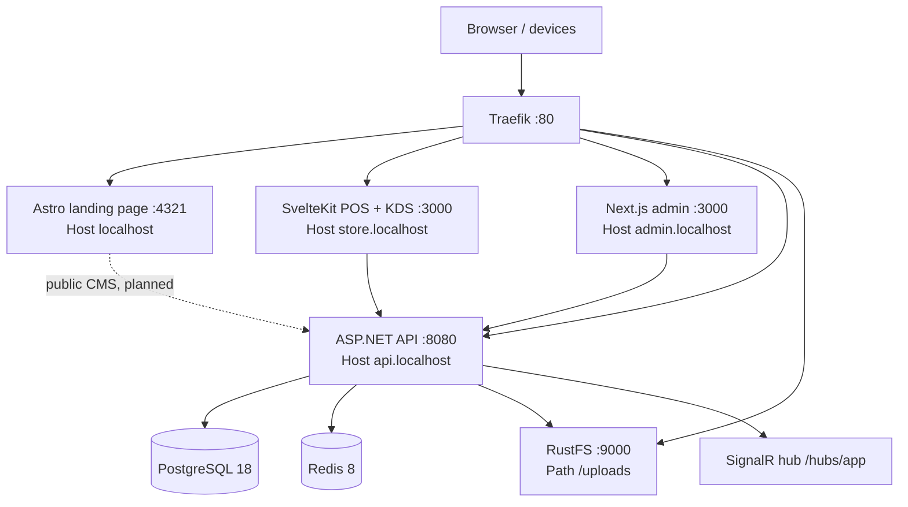

# 1. System Overview

## Product boundary

Foodstore is a restaurant platform with four independently built applications around one .NET API:

| Application | Primary user/job | Technology | Current route boundary |
|---|---|---|---|
| `foodstore-store` | Cashier POS and kitchen display | SvelteKit + Svelte 5 | `store.localhost` |
| `foodstore-admin` | Operational administration, CMS, CRM, e-invoice | Next.js App Router + React | `admin.localhost` |
| `foodstore-landingpage` | Public marketing/landing content | Astro | `localhost` |
| `foodstore-api` | Business rules, persistence, auth, realtime, integrations | ASP.NET Core 10 | `api.localhost` |

The deployment also includes PostgreSQL, Redis, RustFS (S3-compatible object storage), and Traefik.

## Runtime topology



Compose supplies service-to-service configuration through environment variables. Host routing is based on Traefik labels—not path-based routing—except `/uploads`, which is stripped and forwarded to RustFS.

## Root structure

```text
RestaurantPOS/
├── docker-compose.yml              # Production-like local topology
├── .env.example                    # Required configuration contract
├── foodstore-api/                  # .NET solution and SQL utilities
├── foodstore-store/                # POS + kitchen client
├── foodstore-admin/                # Next.js management client
├── foodstore-landingpage/          # Astro public site
├── scripts/                         # Database initialization/seeding SQL
├── docs/                            # Team conventions and API reference
└── ProjectStructure/                # This architecture research
```

## Cross-application contracts

### HTTP API

Controllers receive a `/v2` prefix through `V2RouteConvention`; their attributes contain routes such as `api/admin/orders`, while the externally visible API is `/v2/api/admin/orders`. Most results use an envelope:

```json
{ "data": {}, "error": null, "meta": { "requestId": "...", "timestamp": "..." } }
```

The Svelte client unwraps this envelope in `src/lib/api/utils.ts`; the Next client’s service layer expects the same envelope.

### Authentication and authorization

The API uses ASP.NET Core Identity entities, JWT bearer authentication, a cookie fallback named `auth_token`, refresh tokens, and dynamic permission policies backed by role claims. Permission requirements are declared with `[RequirePermission("module.action")]`.

The POS client keeps a JWT and user record in browser localStorage. The current admin client holds a JWT in a module variable after login and proxies calls through `/api/proxy/*`. This is materially different from the Better Auth BFF described in older documentation; see [06-observations-and-risks.md](06-observations-and-risks.md).

### Realtime contract

`/hubs/app` is an authenticated SignalR hub. Controllers broadcast order and source changes; current event names include `ReceiveOrderUpdate`, `ReceiveNewOrder`, `ReceiveTableUpdate`, and `ReceiveSourceUpdate`. The Store and Admin clients each wrap `@microsoft/signalr`.

## Architectural style

The central API follows a pragmatic Clean Architecture split:

```text
Web (HTTP, middleware, SignalR, composition)
        ↓
Usecase (DTOs, service contracts, business services)
        ↓
Core (entities, constants, configuration)

Infrastructure implements Usecase repository contracts and owns EF Core/S3 persistence.
```

The clients are feature-oriented only at the route/page level; shared API adapters, types, UI primitives, and state utilities live under `src/lib` (Svelte) or `src/lib` plus `src/components` (Next).

## Core business capabilities

* Catalogue: categories, menu items, add-ons, combos, discounts, order sources/tables.
* Transactional operations: cart, orders, payments, status history, kitchen queue.
* People and access: Identity users, employees, customers, roles, permissions, refresh tokens.
* Management: dashboard reports, forecasting/recommendations, media, payment settings.
* Publishing: posts, categories, tags, revisions, blocks, SEO settings.
* Compliance/integration: e-invoice providers, issued invoices, S3 media, Redis cache, SignalR events.
