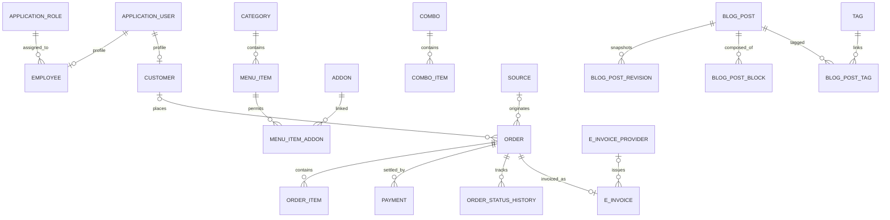

# 4. Data Domain and Integrations

## Persistence model

`StoreDbContext` inherits from `IdentityDbContext<ApplicationUser, ApplicationRole, Guid>`. It owns Identity mappings plus 29 domain `DbSet`s. PostgreSQL uses UUID-oriented records, audit timestamps, and Vietnamese ICU collation support.

## Aggregate groups

| Group | Principal records | Purpose |
|---|---|---|
| Identity/access | `ApplicationUser`, `ApplicationRole`, `Employee`, `Customer`, `RefreshToken` | Authentication, profiles, staff roles and customer loyalty |
| Catalogue | `Category`, `MenuItem`, `Addon`, `MenuItemAddon`, `Combo`, `ComboItem`, `Discount` | Products and pricing composition |
| Operations | `Source`, `Order`, `OrderItem`, `OrderItemAddon`, `OrderStatusHistory`, `Payment`, `PaymentSetting` | Service location/table, order lifecycle and settlement |
| Publishing | `BlogPost`, `BlogCategory`, `Tag`, links, revisions, blocks, settings | CMS and public content |
| Media | `Media` | File metadata; binary content lives in RustFS |
| E-invoice | `EInvoiceProvider`, `EInvoice`, `EInvoiceSetting` | Provider configuration and invoice lifecycle |

## Key lifecycle state

The documented order values are `pending`, `confirmed`, `preparing`, `ready`, `served`, `paid`, and `cancelled`. Actual UI/controller transitions must be treated as the operational source of truth: the kitchen page moves orders to `preparing` then `served`; payment processing and order services determine when a created order reaches paid/confirmed. Model valid transitions explicitly in a fresh project rather than accepting arbitrary strings at every API endpoint.

E-invoices use `draft`, `issued`, `failed`, and `cancelled`. There is one invoice per order (`EInvoice.OrderId` has a unique index), although its provider is optional (`SetNull` delete behavior).

## Auditing and deletion

Most domain entities implement `IAuditableEntity`; `AuditSaveChangesInterceptor` applies created/updated metadata. Current configuration is not a universal soft-delete policy. Do not assume every entity can be restored after deletion; define retention and deletion policy aggregate by aggregate.

## External integrations

| Integration | Adapter/configuration | Responsibility |
|---|---|---|
| PostgreSQL | Npgsql + EF Core, `ConnectionStrings:DefaultConnection` | Authoritative transactional data |
| Redis | `AddStackExchangeRedisCache`, `ConnectionStrings:Redis` | Distributed cache with `foodstore:` key prefix |
| RustFS | AWS S3 client, `S3:Endpoint/AccessKey/SecretKey/Bucket/PublicUrl` | Binary media object storage |
| SignalR | `AppHub`, `/hubs/app` | Push order/source changes to connected clients |
| E-invoice | `IEInvoiceProviderFactory`, MISA and Viettel adapters | Issue, test, cancel and persist invoices |
| ML.NET | Report service | Forecasting and product co-occurrence recommendations |

## Media lifecycle

Media is a two-part resource: bytes are uploaded through the S3 adapter to RustFS, while `media` stores filename, folder, URL, MIME/type, byte size, alt text, uploader and optional entity linkage. The API includes media listing, deletion, usage checking, unused discovery and cleanup. In a new project, make object deletion transactional or compensate reliably when database persistence fails.

## Configuration boundary

The root `.env.example` is the deployment configuration contract. Docker Compose maps it to .NET configuration with double underscores and to client `PUBLIC_*` values. Secrets should remain in an untracked `.env`/secret manager; committed API settings should only contain placeholders. The checked-in API `appsettings.json` still contains a development-looking database connection value, so sanitize it before using this repo as a template.
